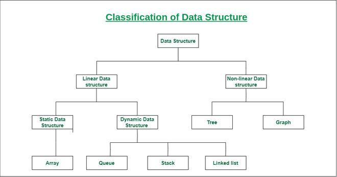

# **Syllabus for Learning Data Structures and Algorithms (DSA)**

---

### **1. Introduction to DSA**

   - **Topics**:
     - What is DSA? 
     - Importance of DSA in problem-solving
     - Time and Space Complexity: Big-O Notation
     - Types of problems solved by DSA

   - **Resources**:
     - [GeeksforGeeks: Introduction to DSA](https://www.geeksforgeeks.org/data-structures/)
     - [YouTube: Introduction to Time Complexity](https://www.youtube.com/watch?v=FJTe8jeAB6s)  
     - [Big-O Notation explained](https://www.bigocheatsheet.com/)

---

### **2. Arrays**

   - **Topics**:
     - Array Representation and Operations (Insertion, Deletion, Traversing)
     - Multi-dimensional Arrays
     - Searching Algorithms (Linear Search, Binary Search)
     - Sorting Algorithms (Bubble Sort, Selection Sort, Insertion Sort)
     - Common Problems (Largest/Smallest Element, Reverse Array, Missing Number, etc.)

   - **Resources**:
     - [GeeksforGeeks: Arrays](https://www.geeksforgeeks.org/array-data-structure/)
     - [LeetCode: Array Questions](https://leetcode.com/tag/array/)
     - [YouTube: Arrays and its Operations](https://www.youtube.com/watch?v=R6YFrE70jSo)
     - [Sorting Algorithms - Visualized](https://www.youtube.com/watch?v=yyH7cGhnHpc)
     - [Array Guide](https://www.geeksforgeeks.org/array-data-structure-guide/)
     - [Practice Problems](https://www.geeksforgeeks.org/explore?page=1&category=Arrays&sortBy=submissions)
     - [Top 50 Coding Interviews Question](https://www.geeksforgeeks.org/top-50-array-coding-problems-for-interviews/)
---

### **3. Strings**

   - **Topics**:
     - String Representation and Operations
     - Pattern Matching (Naive Search, Knuth-Morris-Pratt Algorithm)
     - Palindrome Check, Anagram Check
     - Longest Substring without Repeating Characters
     - String Compression

   - **Resources**:
     - [GeeksforGeeks: String Data Structure](https://www.geeksforgeeks.org/string-data-structure/)
     - [LeetCode: String Questions](https://leetcode.com/tag/string/)
     - [YouTube: String Manipulation Algorithms](https://www.youtube.com/watch?v=khKv-8q7YmY)
     - [String Algorithms and Problems](https://www.programiz.com/dsa/string)

---

### **4. Linked Lists**

   - **Topics**:
     - Singly Linked List: Insert, Delete, Traverse
     - Doubly Linked List
     - Reversing a Linked List
     - Detecting Cycles (Floyd’s Cycle Detection)
     - Merging Two Sorted Lists
     - Finding the Middle Element

   - **Resources**:
     - [GeeksforGeeks: Linked List](https://www.geeksforgeeks.org/data-structures/linked-list/)
     - [LeetCode: Linked List Questions](https://leetcode.com/tag/linked-list/)
     - [YouTube: Linked List Introduction](https://www.youtube.com/watch?v=njTh_OwMljA)

---

### **5. Stacks and Queues**

   - **Topics**:
     - Stack Implementation (Array vs Linked List)
     - Queue Implementation (Array vs Linked List)
     - Applications of Stacks (Balanced Parentheses, Infix/Postfix Conversion)
     - Queue Applications (Queue Using Two Stacks, Circular Queue)
   
   - **Resources**:
     - [GeeksforGeeks: Stack and Queue](https://www.geeksforgeeks.org/stack-data-structure/)
     - [LeetCode: Stack Questions](https://leetcode.com/tag/stack/)
     - [YouTube: Stack and Queue Basics](https://www.youtube.com/watch?v=wjI1WNcIntg)
     - [TutorialsPoint: Stack and Queue](https://www.tutorialspoint.com/data_structures_algorithms/)

---

### **6. Recursion**

   - **Topics**:
     - Recursion Basics: Base Case, Recursive Case
     - Recursion vs Iteration
     - Factorial and Fibonacci using Recursion
     - Tower of Hanoi Problem
     - Subset Sum, Permutations and Combinations
   
   - **Resources**:
     - [GeeksforGeeks: Recursion](https://www.geeksforgeeks.org/recursion/)
     - [LeetCode: Recursion Problems](https://leetcode.com/tag/recursion/)
     - [YouTube: Recursion Explained](https://www.youtube.com/watch?v=wMNrSM6nmdg)
     - [TopCoder: Recursion Problems](https://www.topcoder.com/community/competitive-programming/tutorials/recursion-basics/)

---

### **7. Searching Algorithms**

   - **Topics**:
     - Linear Search (O(n))
     - Binary Search (O(log n))
     - Applications of Binary Search (on sorted arrays, rotated arrays)
     - Interpolation Search (O(log log n))

   - **Resources**:
     - [GeeksforGeeks: Searching Algorithms](https://www.geeksforgeeks.org/searching-algorithms/)
     - [LeetCode: Searching Problems](https://leetcode.com/tag/binary-search/)
     - [YouTube: Binary Search Tutorial](https://www.youtube.com/watch?v=P3YbN2t0pR4)
     - [TopCoder: Searching Algorithms](https://www.topcoder.com/community/competitive-programming/tutorials/searching-algorithms/)

---

### **8. Sorting Algorithms**

   - **Topics**:
     - Bubble Sort, Selection Sort, Insertion Sort
     - Merge Sort (O(n log n))
     - Quick Sort (O(n log n) average case)
     - Counting Sort, Radix Sort, Bucket Sort (Non-comparison sorts)
   
   - **Resources**:
     - [GeeksforGeeks: Sorting Algorithms](https://www.geeksforgeeks.org/sorting-algorithms/)
     - [LeetCode: Sorting Problems](https://leetcode.com/tag/sorting/)
     - [YouTube: Sorting Algorithms Explained](https://www.youtube.com/watch?v=ZZuD6iUeJmE)
     - [Visualizations of Sorting Algorithms](https://www.youtube.com/watch?v=ThI4u8cI0zs)

---

### **9. Hashing**

   - **Topics**:
     - Hash Table Concepts (Hash Function, Collision Resolution)
     - Implementing HashMap
     - Applications of Hashing (Finding Duplicates, Frequency Count, Anagram Detection)
   
   - **Resources**:
     - [GeeksforGeeks: Hashing](https://www.geeksforgeeks.org/hashing-data-structure/)
     - [LeetCode: Hashing Problems](https://leetcode.com/tag/hash-table/)
     - [YouTube: Hashing Explained](https://www.youtube.com/watch?v=5Bd-Kg1OtbY)

---

### **10. Basic Graphs**

   - **Topics**:
     - Graph Representations (Adjacency Matrix, Adjacency List)
     - Graph Traversals (DFS, BFS)
     - Cycle Detection in Directed Graphs
     - Shortest Path Algorithms (BFS for unweighted graphs)
     - Topological Sorting (for Directed Acyclic Graphs)
   
   - **Resources**:
     - [GeeksforGeeks: Graphs](https://www.geeksforgeeks.org/graph-data-structure-and-algorithms/)
     - [LeetCode: Graph Problems](https://leetcode.com/tag/graph/)
     - [YouTube: Graph Algorithms](https://www.youtube.com/watch?v=AfKrlh88d6I)
     - [Graph Theory Basics](https://www.topcoder.com/community/competitive-programming/tutorials/graph-theory-101/)

---

### **11. Dynamic Programming (Introduction)**

   - **Topics**:
     - Dynamic Programming Basics (Overlapping Subproblems, Optimal Substructure)
     - Fibonacci Sequence using DP
     - Coin Change Problem
     - 0/1 Knapsack Problem
   
   - **Resources**:
     - [GeeksforGeeks: Dynamic Programming](https://www.geeksforgeeks.org/dynamic-programming/)
     - [LeetCode: Dynamic Programming Problems](https://leetcode.com/tag/dynamic-programming/)
     - [YouTube: Dynamic Programming Tutorials](https://www.youtube.com/watch?v=oBt53YbR9Kk)
     - [TopCoder: Dynamic Programming](https://www.topcoder.com/community/competitive-programming/tutorials/dynamic-programming/)

---

### **12. Advanced Data Structures (Optional for Beginners)**

   - **Topics**:
     - Trie: Prefix Tree for efficient string search
     - Segment Tree: Range Queries and Updates
     - Binary Indexed Tree (Fenwick Tree)

   - **Resources**:
     - [GeeksforGeeks: Trie Data Structure](https://www.geeksforgeeks.org/trie-insert-and-search/)
     - [Segment Trees Explained](https://www.geeksforgeeks.org/segment-tree-set-1-sum-of-given-range/)
     - [Fenwick Tree](https://www.geeksforgeeks.org/binary-indexed-tree-or-fenwick-tree-2/)

---